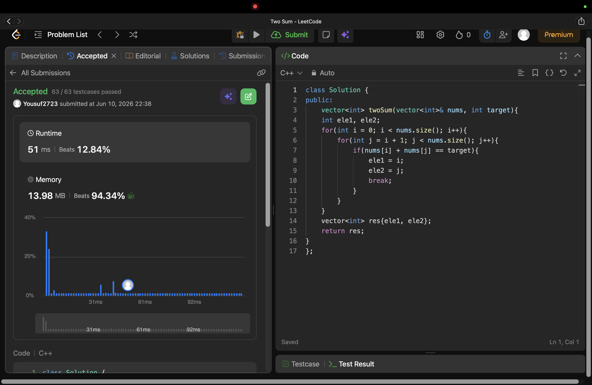

# Problem Link 
https://leetcode.com/problems/two-sum/description/

## SS of submission


```C++
#include<iostream>
#include<vector>
using namespace std;

vector<int> twoSum(vector<int>& nums, int target){
    int ele1, ele2;
    for(int i = 0; i < nums.size(); i++){
        for(int j = i + 1; j < nums.size(); j++){
            if(nums[i] + nums[j] == target){
                ele1 = i;
                ele2 = j;
                break;
            }
        }
    }
    vector<int> res{ele1, ele2};
    return res;
}
```
