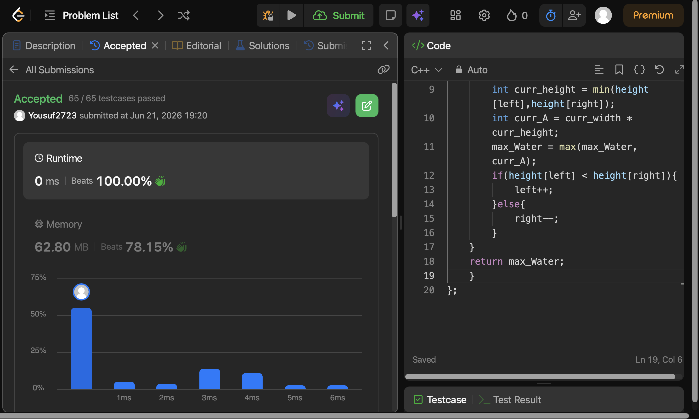

# Problem Link 
https://leetcode.com/problems/container-with-most-water/description/

## SS of submission


```C++
int maxArea(vector<int>& height){
    int left = 0;
    int right = height.size() - 1;
    int max_Water = 0;
    while(left < right){
        int curr_width = right - left;
        int curr_height = min(height[left],height[right]);
        int curr_A = curr_width * curr_height;
        max_Water = max(max_Water,curr_A);
        if(height[left] < height[right]){
            left++;
        }else{
            right--;
        }
    }
    return max_Water;
}
```