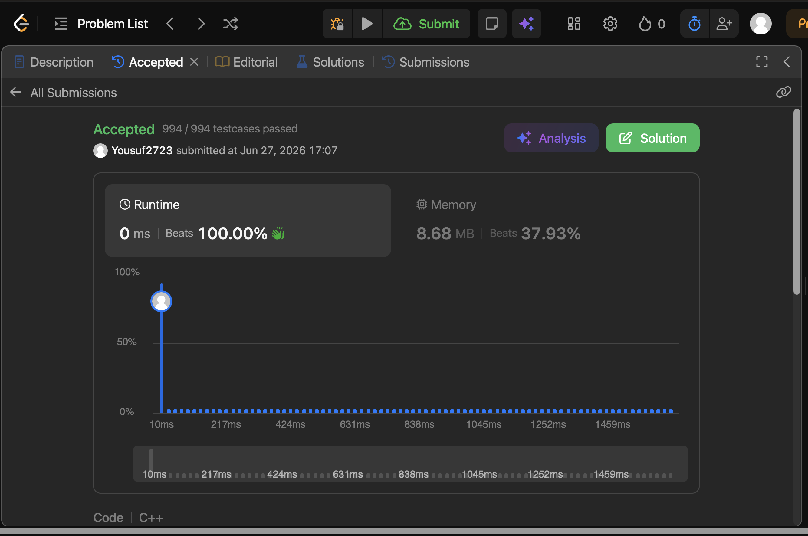

# Problem Link 
https://youtu.be/MeGDaWiOo_M?si=2Aa_jCTaGbyLCJhF

## SS of submission


```C++
int divide(int dividend, int divisor) {
    if (dividend == INT_MIN && divisor == -1) return INT_MAX;

    bool isNegative = (dividend < 0) ^ (divisor < 0);

    long long number = abs((long long)dividend);
    long long div = abs((long long)divisor);
    long long ans = 0;

    while (number >= div) {
        int cnt = 0;
        while (number >= (div << (cnt + 1))) {
            cnt++;
        }
        ans += (1LL << cnt);
        number -= (div << cnt);
    }

    return isNegative ? -ans : ans;
}
```

## Helpful Resources
https://youtu.be/MeGDaWiOo_M?si=2Aa_jCTaGbyLCJhF