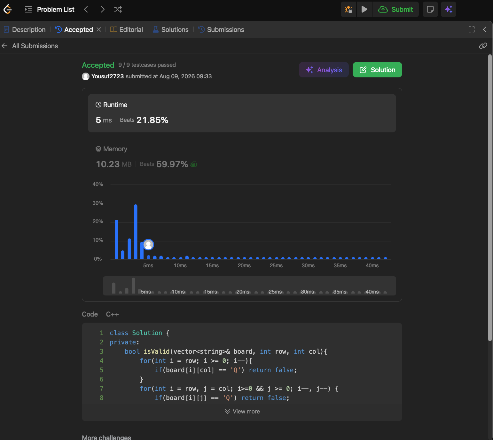

# Problem Link 
https://leetcode.com/problems/n-queens/

## SS of submission


```C++
class Solution {
private:
    bool isValid(vector<string>& board, int row, int col){
        for(int i = row; i >= 0; i--){
            if(board[i][col] == 'Q') return false;
        }
        for(int i = row, j = col; i>=0 && j >= 0; i--, j--) {
            if(board[i][j] == 'Q') return false;
        }
        for(int i = row, j = col; i>=0 && j<board.size(); i--, j++) {
            if(board[i][j] == 'Q') return false;
        }
        
        return true;
    }
    
    void Solve(vector<string>& board, int row, vector<vector<string>>& result){
        if(row == board.size()){
            result.push_back(board);
            return;
        }
        for(int i = 0; i < board.size(); i++){
            if(isValid(board,row,i)){
                board[row][i] = 'Q';
                Solve(board, row + 1, result);
                board[row][i] = '.';
            }
        }
    }
    
public:
    vector<vector<string>> solveNQueens(int n) {
        vector<string> board(n, string(n, '.'));
        vector<vector<string>> result;
        Solve(board, 0, result);
        return result;
    }
};
```

## Helpful Resources
https://youtu.be/FOY49yQcbQ4?si=w6KY1vDZ8OL5gPfO