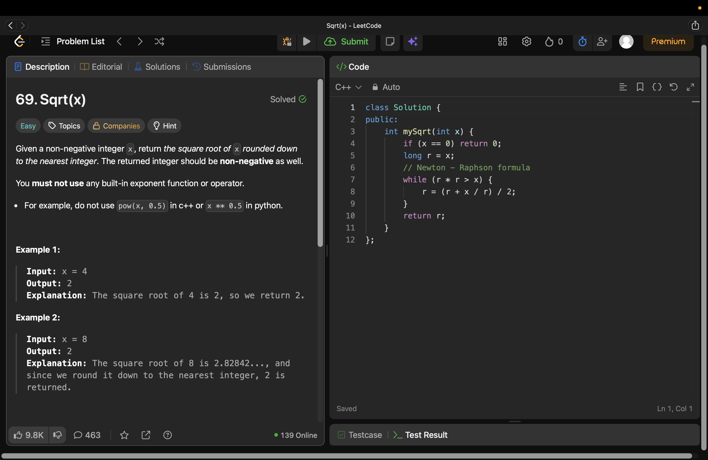

# Problem Link 
https://leetcode.com/problems/sqrtx/description/
## SS of submission


```C++
#include<iostream>
using namespace std;

int mySqrt(int x) {
        if (x == 0) return 0;
        long r = x;
        // Newton - Raphson formula
        while (r * r > x) {
            r = (r + x / r) / 2;
        }
        return r;
    }

int main(){
    int x;
    cout << "Enter num : ";
    cin >> x;

    cout << "Sqrt of " << x << " : " << mySqrt(x);
}
```

## Helpful Resources
### The Newton-Raphson Method (Recommended)

The Newton-Raphson method is a calculus-based root-finding algorithm. It is highly efficient and converges on the correct answer much faster than binary search.

**The Math:** Given a number $S$, we want to find its square root. We start with an initial guess $x_0$ (usually just $S$). We then repeatedly apply this formula to get closer to the true root:

$$x_{n+1} = \frac{1}{2} \left( x_n + \frac{S}{x_n} \right)$$