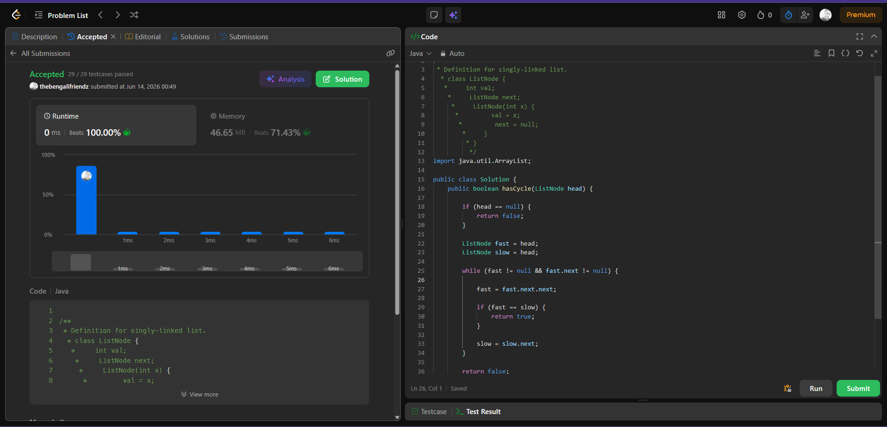

# Problem Link

https://leetcode.com/problems/linked-list-cycle/

## SS of submission



```Java

/**
 * Definition for singly-linked list.
 * class ListNode {
 *     int val;
 *     ListNode next;
 *     ListNode(int x) {
 *         val = x;
 *         next = null;
 *     }
 * }
 */
import java.util.ArrayList;

public class Solution {
    public boolean hasCycle(ListNode head) {

        if (head == null) {
            return false;
        }

        ListNode fast = head;
        ListNode slow = head;

        while (fast != null && fast.next != null) {

            fast = fast.next.next;

            if (fast == slow) {
                return true;
            }

            slow = slow.next;
        }

        return false;

    }
}

```

## Helpful Resources
