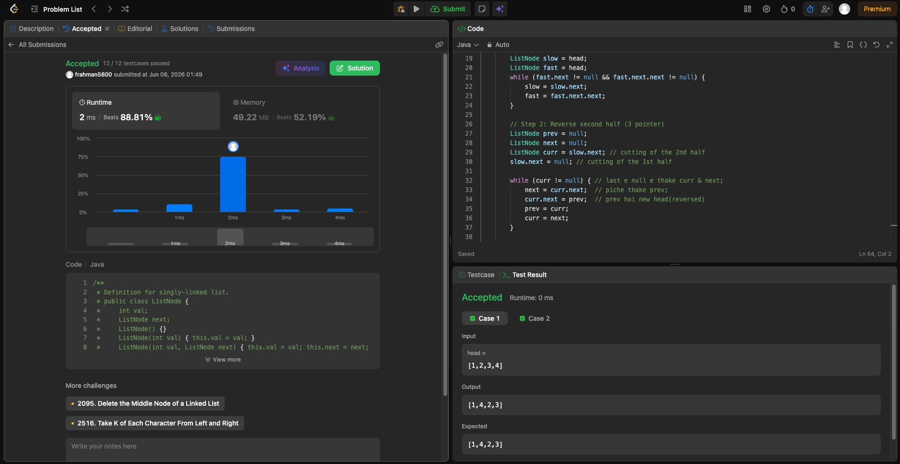

# Problem Link 
https://leetcode.com/problems/reorder-list/description/

## SS of submission


```Java
class Solution {
    public void reorderList(ListNode head) {
        // Base case:
        if (head == null || head.next == null) {
            return;
            }

        // Step 1: Find middle
        ListNode slow = head;
        ListNode fast = head;
        while (fast.next != null && fast.next.next != null) {
            slow = slow.next;
            fast = fast.next.next;
        }

        // Step 2: Reverse second half (3 pointer)
        ListNode prev = null;
        ListNode next = null;
        ListNode curr = slow.next; // cutting of the 2nd half
        slow.next = null; // cutting of the 1st half

        while (curr != null) { // last e null e thake curr & next; 
            next = curr.next;  // piche thake prev; 
            curr.next = prev;  // prev hoi new head(reversed)
            prev = curr;
            curr = next;
        }

        // Step 3: Merge two halves
        ListNode first = head;  // 1st half
        ListNode second = prev; // 2nd half

        while (second != null) {
            ListNode tmp1 = first.next;
            ListNode tmp2 = second.next;

            first.next = second;
            second.next = tmp1;

            first = tmp1;
            second = tmp2;
        }
    }
}
```

