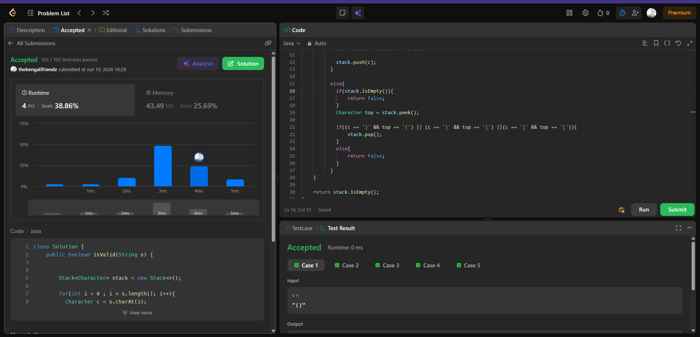

# Problem Link 
https://leetcode.com/problems/valid-parentheses/

## SS of submission


```JAVA
class Solution {
    public boolean isValid(String s) {


        Stack<Character> stack = new Stack<>();

        for(int i = 0 ; i < s.length(); i++){
          Character c = s.charAt(i);

          if(c=='(' || c=='{' || c=='['){

            stack.push(c);
          }

          else{
            if(stack.isEmpty()){
                return false;
            }
            Character top = stack.peek();

            if((c == ')' && top == '(') || (c == '}' && top == '{') ||(c == ']' && top == '[')){
                stack.pop();
            }
            else{
                return false;
            }
          }
    }

    return stack.isEmpty();
}
}
```

