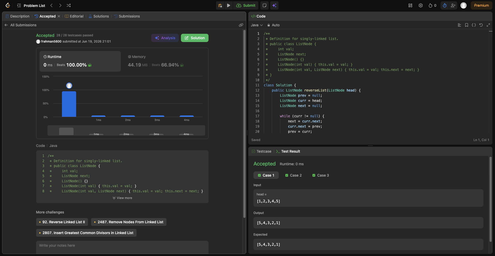

# Problem Link 
https://leetcode.com/problems/reverse-linked-list/description/


## SS of submission

``` Java
class Solution {
    public ListNode reverseList(ListNode head) {
        ListNode prev = null;
        ListNode curr = head;
        ListNode next = null;  

        while (curr != null) {
            next = curr.next;  
            curr.next = prev;   
            prev = curr;        
            curr = next;        
        }

        return prev;
    }
}
```
